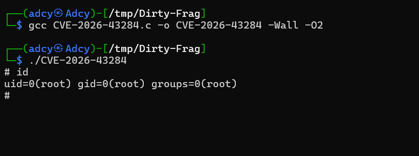

<div align="center">

# 💥 CVE-2026-43284 — Dirty Frag 💥


---

### ⚡ Dirty Frag Local Privilege Escalation Proof of Concept ⚡

</div>

---

# 📖 Description

This repository contains a **Proof of Concept (PoC)** for:

> **CVE-2026-43284 — Dirty Frag**

The exploit demonstrates a vulnerability affecting vulnerable Linux systems.

---

# 🧠 About Dirty Frag

**Dirty Frag** (sometimes referred to as **Copy Fail 2**) is a critical Linux kernel local privilege escalation vulnerability affecting multiple kernel subsystems.

The bug enables an **unprivileged local attacker** to escalate privileges and gain **root access** on vulnerable systems through controlled page-cache corruption.

Originally discovered by **Hyunwoo Kim (@v4bel)**, the vulnerability is considered a modern successor to earlier Linux page-cache exploitation techniques such as **Dirty Pipe** and **Copy Fail**.

---

## ⚡ Vulnerability Details

| Field | Information |
|------|-------------|
| CVE | CVE-2026-43284 |
| Additional CVE | CVE-2026-43500 |
| Nickname | Dirty Frag / Copy Fail 2 |
| Impact | Local Privilege Escalation |
| Severity | High / Critical |
| Exploitation | Reliable & Deterministic |
| Disclosure Date | May 2026 |
| Affected Systems | Linux Kernels (2017+) |

---

# 🔬 Technical Overview

The vulnerability originates from unsafe handling of shared socket buffer (`skb`) fragments that reference page-cache-backed memory regions.

Under specific conditions involving:

- `splice(2)`
- `sendfile(2)`
- shared page-cache pages
- in-place packet decryption

the kernel may unintentionally allow modification of read-only cached file data.

This behavior creates a highly powerful:

```text
Arbitrary Page Cache Write Primitive
```

which attackers can abuse to overwrite sensitive files in memory and obtain full root privileges.

---

# 🎯 Main Attack Surfaces

The vulnerability primarily affects the following kernel components:

- 🌐 xfrm / ESP (`esp4`, `esp6`)
- 📡 RxRPC subsystem
- 🗂 AFS-related networking paths

---

# 📖 Related Vulnerabilities

| Vulnerability | Similarity |
|---------------|------------|
| Dirty Pipe | Page-cache overwrite primitive |
| Copy Fail | Earlier Linux kernel page corruption |
| Dirty COW | Privilege escalation via memory race |


---

# 🛠 Compilation

Compile the exploit using GCC:

```bash
gcc CVE-2026-43284.c -o CVE-2026-43284 -Wall -O2
```

---

# ▶ Usage

Run the compiled binary:

```bash
./CVE-2026-43284
```

---

# 📸 Proof of Concept

<div align="center">



</div>

---

# 📦 Requirements

| Requirement | Version |
|------------|---------|
| Linux Kernel | Vulnerable Version |
| GCC | Any Recent Version |
| Architecture | x86_64 Recommended |

---

# 🔧 Install GCC

## Debian / Ubuntu

```bash
sudo apt update
sudo apt install gcc
```

## Arch Linux

```bash
sudo pacman -S gcc
```

## Fedora

```bash
sudo dnf install gcc
```

---

# ⚠ Disclaimer

```diff
- This project is for educational and authorized security research only.
- Do NOT use this against systems without permission.
- The author assumes no liability for misuse or damages.
```

---

# 🧠 Technical Notes

- Tested on vulnerable Linux environments
- Intended for security researchers and CTF environments
- Behavior may vary depending on kernel mitigations

---

# 📚 References

## Official & Security References

- 🔗 CVE Record  
  https://www.cve.org/CVERecord?id=CVE-2026-43284

- 🔗 NVD Entry  
  https://nvd.nist.gov/vuln/detail/CVE-2026-43284

- 🔗 Plesk Security Advisory  
  https://support.plesk.com/hc/en-us/articles/40314546777239-Vulnerability-CVE-2026-43284-Dirty-Frag

- 🔗 Tenable Research  
  https://www.tenable.com/blog/dirty-frag-cve-2026-43284-cve-2026-43500-frequently-asked-questions-linux-kernel-lpe

- 🔗 Help Net Security Article  
  https://www.helpnetsecurity.com/2026/05/08/dirty-frag-linux-vulnerability-cve-2026-43284-cve-2026-43500/

- 🔗 Dirty Frag Technical Writeup  
  https://www.dirtyfrag.tech/

- 🔗 WebWorld Security Analysis  
  https://www.webworld.blog/2026/05/08/dirty-frag-cve-2026-43284/

- 🔗 Skynats Advisory  
  https://www.skynats.com/blog/dirty-frag-linux-kernel-vulnerability/

- 🔗 University of Cologne Security Notice  
  https://itcc.uni-koeln.de/en/services/information-security/it-security/vulnerability-cve-2026-43284-dirty-frag

- 🔗 Reddit Technical Discussion  
  https://www.reddit.com/r/linuxadmin/comments/1t9ncbl/linux_dirty_frag_lpe_cve202643284_cve202643500/

---

## 🧠 Research Credits

- Researcher: **Hyunwoo Kim (@v4bel)**
- Linux Kernel Networking / XFRM subsystem vulnerability research
- Public disclosure: May 2026

---

## 🛡 Related Vulnerabilities

| CVE | Description |
|------|-------------|
| CVE-2026-43284 | xfrm-ESP Page-Cache Write |
| CVE-2026-43500 | RxRPC Page-Cache Write |
| Dirty Pipe | Similar page-cache corruption class |
| Copy Fail | Previous related Linux LPE chain |

---

<div align="center">

## ⭐ Star the repository if you found it useful ⭐

</div>
